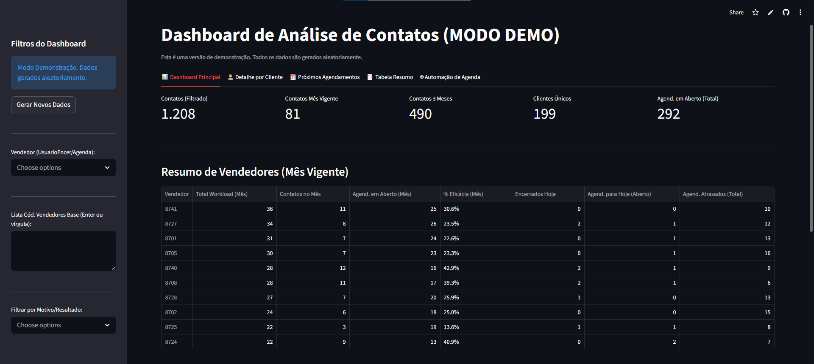
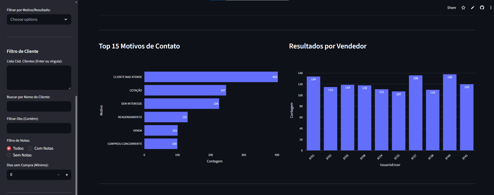
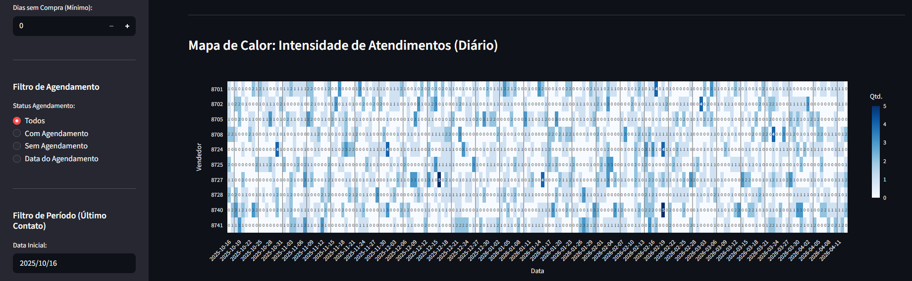
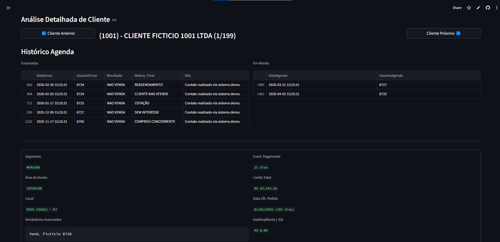
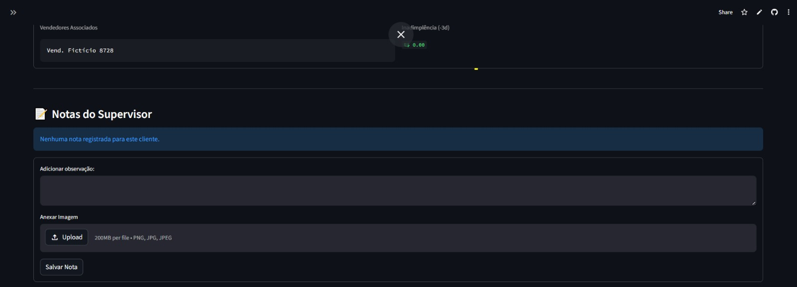
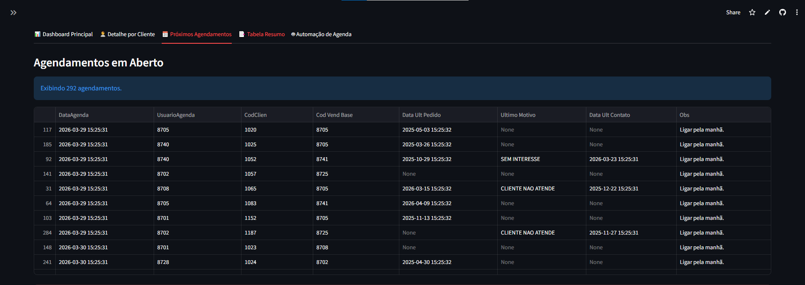
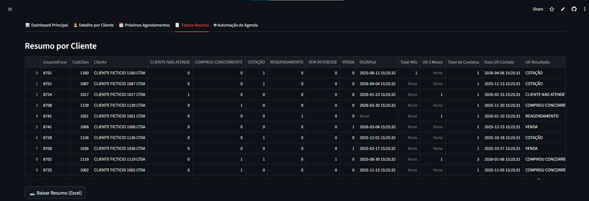
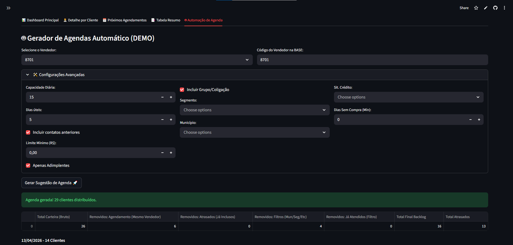

# 📊 Smart Sales & CRM Dashboard

[](https://sales-agenda-crm-dashboard-app-anv6vbo6xhevciv9cannj6.streamlit.app/)
[](https://www.python.org/)
[](https://pandas.pydata.org/)
[](https://plotly.com/)

**Um ecossistema completo de inteligência comercial, gestão de CRM e automação de rotinas de vendas construído inteiramente em Python e Streamlit.**

Este projeto foi desenvolvido para resolver um problema clássico em operações de vendas: a dispersão de dados. Ao unificar o histórico de contatos (CRM), a base de dados de clientes (ERP/SQL) e um motor inteligente de agendamento, o dashboard permite que supervisores e vendedores parem de "apagar incêndios" e passem a atuar de forma estratégica.

---

## 🚀 Demonstração ao Vivo

Acesse a versão de demonstração (rodando com dados fictícios gerados via script) diretamente na nuvem:
👉 **[Acessar Live Demo no Streamlit Cloud](https://sales-agenda-crm-dashboard-app-anv6vbo6xhevciv9cannj6.streamlit.app/)**



---

## 🎯 Principais Funcionalidades

O aplicativo é dividido em 5 módulos principais, pensados para cobrir toda a jornada do gestor de vendas:

### 1. Visão Executiva e Analytics (Dashboard Principal)
Acompanhamento em tempo real do esforço de vendas, com cartões de KPI (Key Performance Indicators) e uma tabela de eficácia de funil por vendedor. 
* **Gráficos de Pareto:** Análise rápida dos principais motivos de não-venda e contatos realizados.
* **Mapa de Calor Diário:** Um *heatmap* dinâmico que mostra a intensidade de ligações/visitas por dia para cada vendedor, incluindo separadores visuais automáticos para o fim da semana (sextas-feiras), evitando a poluição visual de "gráficos de espaguete".




### 2. Visão 360º do Cliente (CRM)
Um módulo de detalhamento profundo (drill-down) que permite navegar por toda a carteira de clientes selecionada pelos filtros.
* Exibe dados de limite de crédito, inadimplência, dias sem compra e histórico cruzado de contatos (Encerrados vs. Em Aberto).
* **Sistema de Notas do Supervisor:** Um micro-CRM embutido que permite adicionar observações em texto e anexar imagens (fotos de fachadas, comprovantes) diretamente no perfil do cliente, salvos de forma persistente.




### 3. Gestão de Backlog (Próximos Agendamentos)
Uma visão clara de tudo o que está programado para o futuro, cruzando a agenda em aberto com o status financeiro do cliente (última compra, último contato e motivo).



### 4. Extração de Dados (Power Query Style)
Motor de consolidação de dados que gera uma "tabela flat" pronta para dinâmicas em Excel. Ele pivota motivos de contato, calcula ocorrências nos últimos 3 meses, mês vigente e traz a próxima agenda. A exportação XLSX ainda inclui nativamente as **fotos em miniatura** anexadas pelo supervisor nas notas.



### 5. 🤖 Motor de Automação de Agenda
O grande diferencial técnico do projeto. Um algoritmo que recebe os filtros de segmento, região, capacidade diária e gera automaticamente listas de prospecção otimizadas para dias úteis futuros.
**A lógica de priorização matemática segue a ordem:**
1. Contatos já agendados, mas em atraso.
2. Clientes sem compra no mês vigente.
3. Clientes da carteira nunca atendidos.
4. Clientes com baixa frequência de contato.
5. Ordenação final por inatividade de compra (Dias sem compra).



---

## 🛠️ Arquitetura Técnica e Tecnologias

* **Front-end / Framework:** `Streamlit` para a construção rápida de interfaces reativas e painéis de dados.
* **Engenharia de Dados (ETL):** `Pandas` e `NumPy`. Manipulação complexa envolvendo múltiplos *merges*, *pivot tables*, tratamento de datas e agregações.
* **Visualização:** `Plotly Express` para gráficos interativos de alta fidelidade e mapas de calor com customização de *shapes* matemáticos.
* **Banco de Dados (Produção):** Conexão nativa com SQL Server usando `pyodbc` e injeção de *queries* parametrizadas.
* **Persistência Local:** Gerenciamento de arquivos JSON e sistema de I/O de imagens via `uuid` e buffers binários.
* **Exportação Avançada:** Geração dinâmica de arquivos Excel (`xlsxwriter` e `openpyxl`) com injeção de mídias/imagens direto nas células.

---

## 📂 Estrutura do Repositório

* `app_producao.py`: Código-fonte para ambiente de produção (Requer conexão SQL Server configurada no `.env`).
* `app_demo.py`: Versão adaptada para portfólio. Substitui o motor de banco de dados por funções criadas no Pandas/Numpy que geram milhares de linhas de *mock data* (dados fictícios e aleatórios) de forma determinística e realista.
* `requirements.txt`: Dependências do projeto.
* `.env.example`: Template de variáveis de ambiente.
* `notas_imagens/`: Diretório base para armazenamento local de mídias anexadas no app.

---

## 💻 Como executar o projeto localmente

1. **Clone o repositório:**
```bash
git clone [https://github.com/lucasnunestrabalho99-sudo/sales-agenda-crm-dashboard.git](https://github.com/lucasnunestrabalho99-sudo/sales-agenda-crm-dashboard.git)
cd sales-agenda-crm-dashboard
```
## 💻 Como executar o projeto localmente

2. **Crie um ambiente virtual (Recomendado) e ative-o:**
   
# Usando a distribuição Anaconda
```bash
conda create -n dashboard_vendas python=3.10
conda activate dashboard_vendas
```

3. **Instale as dependências:**
```bash
pip install -r requirements.txt
```

4. **Para rodar a versão de Demonstração (Sem necessidade de Banco de Dados):**
```bash
streamlit run app_demo.py
```

5. **Para rodar a versão de Produção (Requer Banco de Dados):**
Renomeie o arquivo `.env.example` para `.env`, preencha as credenciais reais do seu banco de dados SQL Server e execute:
```bash
streamlit run app_producao.py
```
